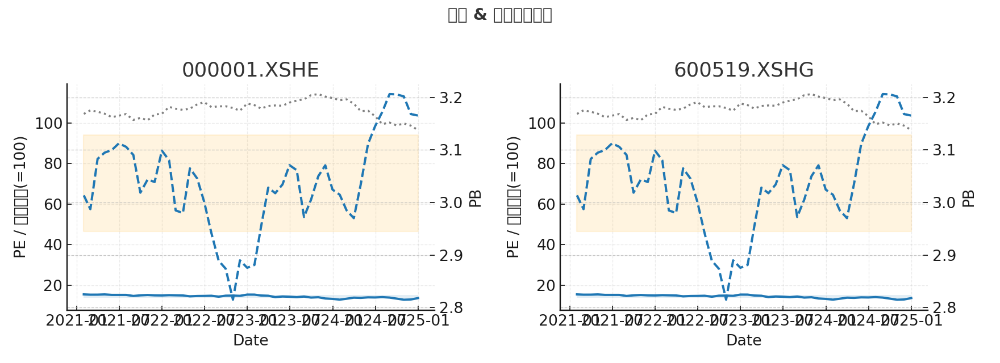

# A股估值可视化工具（PE / PB / 股价）

本项目是一个在 **聚宽 (JoinQuant) Research 平台** 上编写的 Python 工具，用于批量获取并可视化 A 股上市公司的 **市盈率 (PE)**、**市净率 (PB)** 与 **股价走势**。

> 🧰 数据来源：聚宽 `jqdata` 接口 (`get_price`, `get_fundamentals_continuously`)

---

## ✨ 功能特点
- **批量绘制**：一次性支持多只股票，自动排版。
- **双坐标轴展示**：
  - 左轴：PE（蓝色实线）、股价（灰色点虚线，可选指数化=100）
  - 右轴：PB（橙色虚线）
- **统计分析**：自动绘制 **均值 ± 1σ** 的阴影区间。
- **灵活参数**：
  - 支持日频 / 周频 / 月频数据（`resample`）
  - 支持滚动中位数平滑（`smooth_window`）
- **数据导出**：生成单股 CSV + 汇总 CSV，方便二次分析。

---

## 🖼️ 示例效果
（这里放一张运行后的截图）



---

## 📦 项目结构
```
pepb-visualization/
├── README.md              # 英文说明
├── README_zh.md           # 中文说明
├── requirements.txt       # 依赖（本地运行用；聚宽环境无需安装）
├── pe_measure.py          # 主代码
└── examples/
    └── output_sample.png  # 示例输出图
```

---

## 🚀 使用方法（聚宽 Research）
1. 将 `pe_measure.py` 上传至聚宽 Research。
2. 修改 `stocks` 列表，填入你关心的股票代码（如 `000001.XSHE`）。
3. 执行脚本，即可在 Notebook 中看到图表，并在 `pepb_out/` 文件夹生成 CSV。

---

## 🔧 参数说明
- `resample`：重采样频率  
  - `'M'` → 月频  
  - `'W'` → 周频  
  - `None` → 日频（原始数据）
- `price_indexed`: 是否将股价归一化到首日=100，便于与PE曲线对比。
- `smooth_window`: 平滑窗口大小，默认 `3`；设为 `1` 关闭平滑。
- `out_dir`: 输出文件夹，默认 `pepb_out/`。
- `combined_csv`: 汇总输出文件名。

---

## 📑 技术亮点
- **数据清洗**：自动处理 NaN、无穷大，避免绘图报错。
- **稳健设计**：支持批量接口和逐日接口两种方式，保证获取估值数据稳定。
- **美观可视化**：双坐标轴 + 阴影区间 + 可选平滑，便于观察估值与股价关系。

---

## 🧑‍💻 作者
- 学生量化爱好者，正在学习 **Python 金融数据分析** 和 **量化策略开发**。
- 本项目作为个人开源练习和实习申请展示案例。
